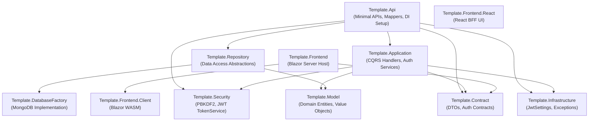

# Template API Generator — Project Structure & Architecture

## Overview & Purpose

The **Template API Generator** is a production-ready reference template for building microservices and Web APIs in .NET 9. It is designed around clean/layered architecture principles, utilizing MongoDB as the document store, CQRS (Command Query Responsibility Segregation) for application operations, and a built-in authentication and security subsystem (PBKDF2 password hashing and JWT bearer tokens).

This repository serves as:
1. A reference implementation of a complete layered .NET application.
2. A template source used by automated agents to scaffold new domain-specific solutions based on JSON schema specifications.

---

## High-Level Architecture

The template enforces a strict separation of concerns across projects:

```
┌────────────────────────────────────────────────────────────────────────┐
│                          Presentation Layer                            │
│  - Template.Api: ASP.NET Core Minimal API endpoints & Swagger          │
│  - Template.Frontend: Blazor Server Host (Identity & UI)               │
│  - Template.Frontend.Client: Blazor WebAssembly Client                 │
│  - Template.Frontend.React: React/Next.js UI (MonsterAdmin styling)    │
└────────────────────────────────────┬───────────────────────────────────┘
                                     │
                                     ▼
┌────────────────────────────────────────────────────────────────────────┐
│                          Application Layer                             │
│  - Template.Application: CQRS Command & Query Handlers, Domain &       │
│                         Authentication Services                        │
│  - Template.Contract: Public DTOs and API request/response contracts   │
└──────────────────┬─────────────────────────────────┬───────────────────┘
                   │                                 │
                   ▼                                 ▼
┌──────────────────────────────────────┐   ┌─────────────────────────────┐
│             Domain Layer             │   │       Security Layer        │
│  - Template.Model: Entities (Id),    │   │  - Template.Security:       │
│    Value Objects, Repository contracts│   │    PBKDF2 PasswordHasher,   │
│    and Domain Exceptions             │   │    JWT TokenService         │
└──────────────────┬───────────────────┘   └─────────────────────────────┘
                   │
                   ▼
┌────────────────────────────────────────────────────────────────────────┐
│                         Infrastructure Layer                           │
│  - Template.Repository: Repository interfaces & DI registrations       │
│  - Template.DatabaseFactory: MongoDB driver implementation (MongoRepo) │
│  - Template.Infrastructure: Shared settings (JWT, Cookies) & Exceptions│
└────────────────────────────────────────────────────────────────────────┘
```

---

## Solution Dependency Graph



---

## Projects Catalog

All core backend source code and libraries reside under the `src/` directory.

### 1. `Template.Api`
- **Role**: Application entry point, HTTP routing, and endpoint definition.
- **Key Concepts**:
  - ASP.NET Core Minimal APIs.
  - Endpoint Mappers (`Extensions/EndpointMappers/`): Each resource has an endpoint mapper (e.g., `AuthenticationMapper.cs`, `UserMapper.cs`, `StatusMapper.cs`) with standardized endpoints.
  - Uniform Execution via `ApiHandler.HandleEndpointAsync`: Dispatches requests through handlers while standardizing error handling and status code mapping.
  - Global Exception Handling & Problem Details.
  - OpenAPI / Swagger documentation configuration.

### 2. `Template.Application`
- **Role**: Application use cases and business orchestration.
- **Key Concepts**:
  - **CQRS Pattern**:
    - Queries: `IQueryHandler<QuerySingle<T>, T>` and `IQueryHandler<QueryMany<T>, List<T>>`.
    - Commands: `ICommandHandler<Command<T>, T>` supporting Create, Update, and Delete operations.
  - **Security & User Management**:
    - `IAuthenticationService` & `AuthenticationService`: Login, token refresh, token revocation, user info.
    - `IUserRegistrationService` & `UserRegistrationService`: Registration and credential setup.
  - `ServiceCollectionExtensions.cs`: Registers handlers and application services in DI.

### 3. `Template.Contract`
- **Role**: Data Transfer Objects (DTOs) for API communication.
- **Key Concepts**:
  - Decoupled from database representation.
  - Entity contracts are plain C# records/classes (POCOs) where the `Id` property is nullable (`string?`) to allow entity creation without a pre-assigned ID.
  - Contains authentication contracts: `AuthenticationResult`, `RefreshTokenRequest`, `UserCredentialsRequest`, `UserRegistrationRequest`, `UserRegistrationResult`, `UserRegistrationStatus`.

### 4. `Template.Model`
- **Role**: Domain model, domain logic, and domain integrity.
- **Key Concepts**:
  - Entities inherit from `EntityModel`, which implements `IEntity` with a required `string Id`.
  - Rich **Value Objects** for domain concepts (e.g., `PersonName`, `Email`, `UserIdentifier`, `ActiveInfo`).
  - Repository interfaces (`IRepository<T, TId>`).
  - Domain exceptions (e.g., `ResourceNotFoundException`).

### 5. `Template.Repository`
- **Role**: Repository layer contracts and dependency injection bridges.
- **Key Concepts**:
  - Exposes `AddMongoRepository<T>()` in `ServiceCollectionExtensions.cs`.
  - Connects domain repository interfaces to database factory implementations.

### 6. `Template.DatabaseFactory`
- **Role**: Database driver implementation.
- **Key Concepts**:
  - MongoDB integration using official MongoDB .NET driver.
  - `MongoRepository<T>`: Generic repository handling CRUD operations against MongoDB collections.
  - `MongoConfiguration`: Connection strings and database settings.

### 7. `Template.Infrastructure`
- **Role**: Cross-cutting configurations and application-wide infrastructure utilities.
- **Key Concepts**:
  - Settings records: `JwtSettings`, `CookieSettings`.
  - Shared exceptions: `ApplicationErrorException`, `ResourceNotFoundException`.

### 8. `Template.Security`
- **Role**: Cryptography and token management.
- **Key Concepts**:
  - `PasswordHasher`: PBKDF2 with SHA-256 password hashing and salt generation (`IPasswordHasher`).
  - `TokenService`: JWT generation, signing, claims embedding, and validation (`ITokenService`).
  - `TokenResult`: Encapsulates access token and expiration.
  - `ServiceCollectionExtensions.AddSecurityServices()`: One-line registration for security components.

### 9. `Template.Frontend` & `Template.Frontend.Client`
- **Role**: Blazor hybrid web application.
- **Key Concepts**:
  - `Template.Frontend`: Server-side host, layout, ASP.NET Core Identity integration with the API, and Refit API clients (`IAuthenticationApiClient`).
  - `Template.Frontend.Client`: WebAssembly client components supporting client-side interactivity (`RedirectToLogin.razor`, `Auth.razor`).
  - Built-in account management pages: Login, Register, Profile, Manage.

### 10. `Template.Frontend.React` & `Template.MonsterAdmin`
- **Role**: Alternative Next.js / React frontend option.
- **Key Concepts**:
  - React 19 + Next.js 16 frontend with Backend-For-Frontend (BFF) architecture.
  - Theme styling and components aligned with the MonsterAdmin horizontal HTML template assets in `src/Template.Frontend/Template.MonsterAdmin`.

---

## Built-in Authentication & User Management Subsystem

The template includes a fully functional, self-contained authentication and user management system that must be preserved in any generated solution.

### Core Domain Entities
- **`User`**: Core domain entity representing a registered system user.
  - Uses Value Objects: `PersonName` (first/last name), `Email` (normalized lowercase), `UserIdentifier` (unique normalized ID), `ActiveInfo` (activation timestamp and active/inactive state tracking).
- **`UserAccessInfo`**: Stores security sensitive details including password hashes, salt, and refresh tokens.

### Security Endpoints
| Endpoint | Method | Purpose |
|---|---|---|
| `/auth/token` | POST | Authenticates user with credentials and issues access + refresh tokens |
| `/auth/register` | POST | Registers a new user account |
| `/auth/token/refresh` | POST | Exchanges a valid refresh token for a new access token |
| `/auth/token/revoke` | POST | Revokes an active refresh token |
| `/auth/userinfo` | GET | Returns currently authenticated user profile |
| `/user` | GET, POST, PUT, DELETE | Administrative CRUD operations for user accounts |

---

## Local Development & Infrastructure Files

The template provides complete orchestration for local development:
- **`.vscode/`**:
  - `launch.json`: Pre-configured launch profiles for debugging `Template.Api`.
  - `tasks.json`: Build and watch tasks using the .NET CLI.
  - `extensions.json`: Recommended VS Code extensions for C#, Docker, and MongoDB.
- **`mongo-init/01-init.js`**: MongoDB initialization script setting up the database and default collection indexes.
- **`docker-compose.yml`**: Spins up MongoDB (port 27017) and the Web API service with proper network configuration.
- **`.env_template`**: Template for environment variables (connection strings, JWT secrets).
- **`.dockerignore` & `.gitignore`**: Standardized ignores for container builds and source control.
